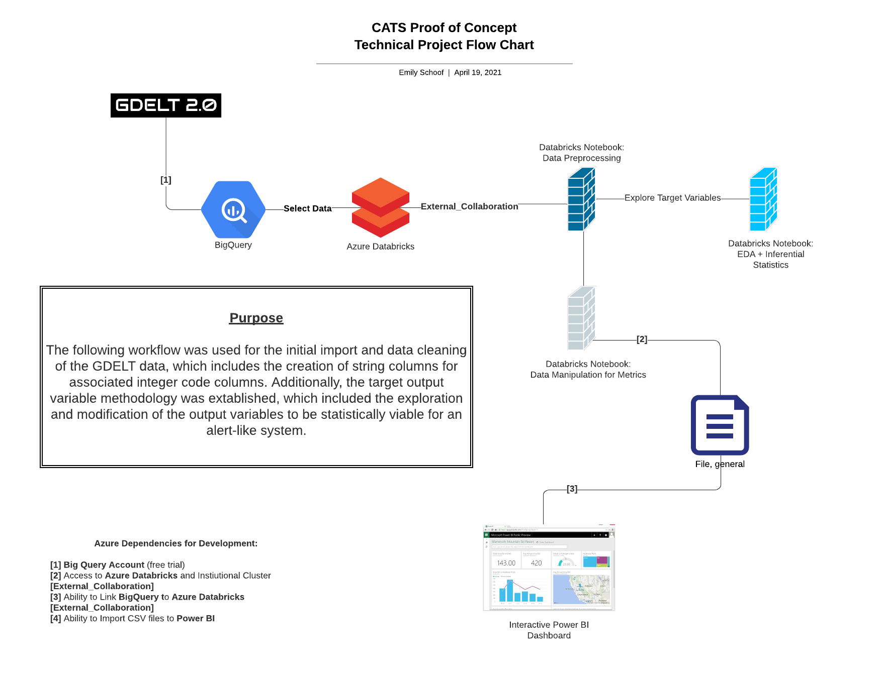
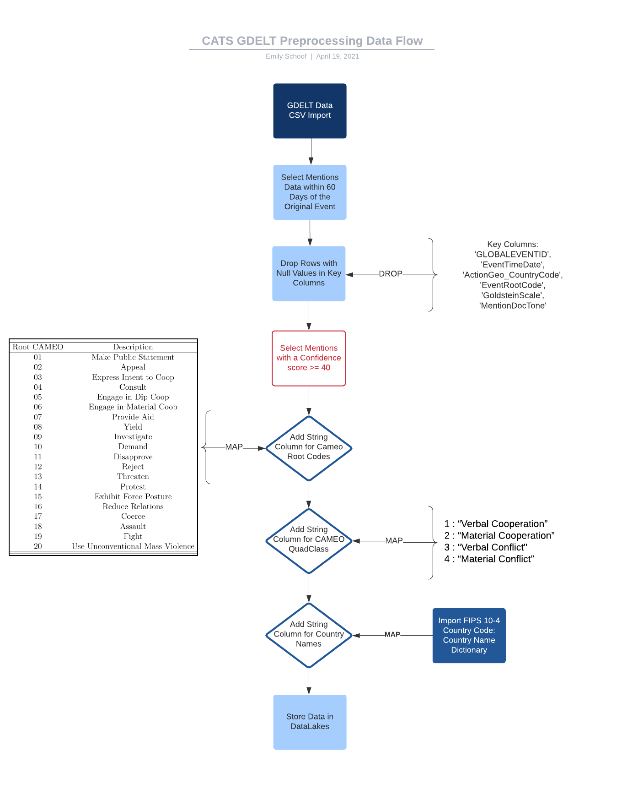
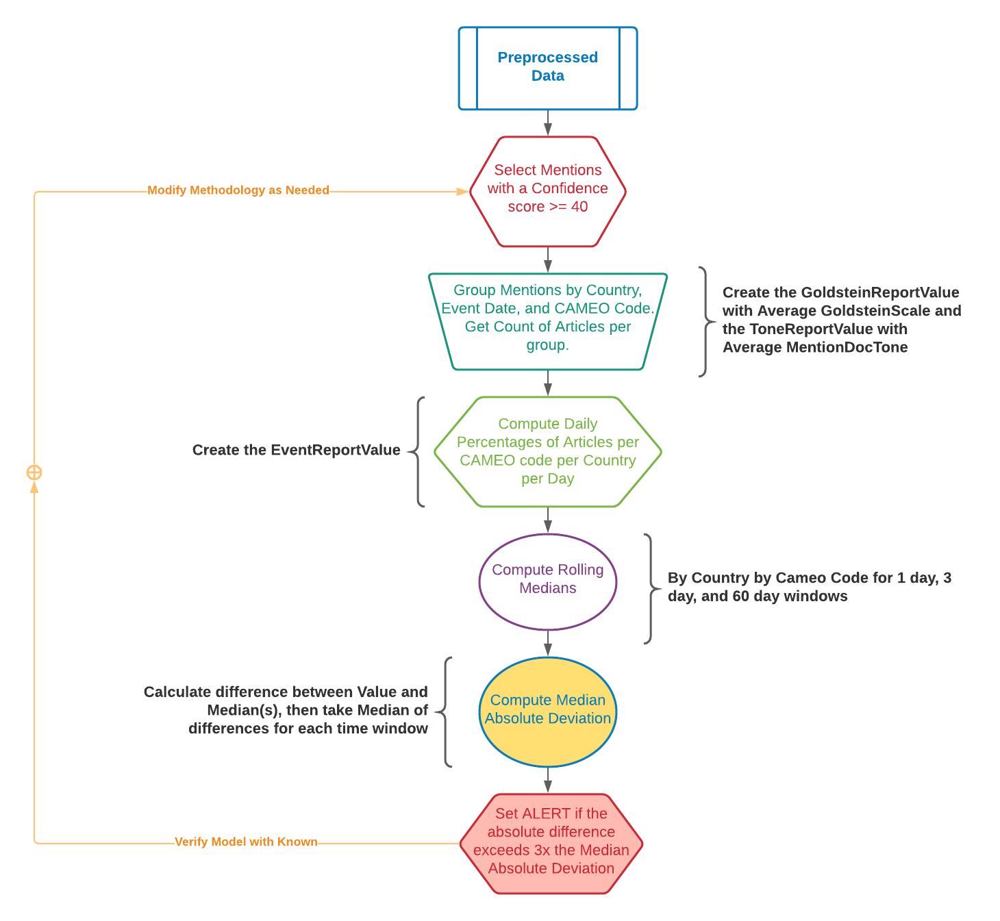
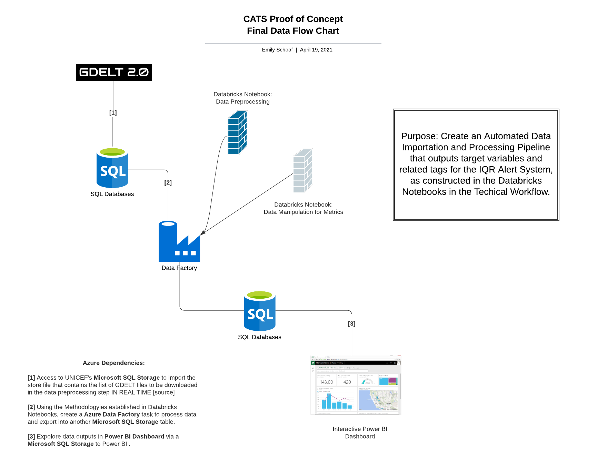

# Contextual Alert and Trend System (CATS) - UNICEF

### Department: 
Risk Analysis and Preparedness Section (RAPS), Office of Emergency Operations (EMOPS)  

### Premise of Task: 
Contextual Alert and Trend System (CATS) is a proof of concept (POC) for an automated system for near real-time media monitoring via GDELT to identify trends and anomalies in the volume of online reports about pre-defined indicator events, at country level. This repository reflects the methodologies used to complete this task.

### Technical Development Workflow

### Data Selection and Preprocessing Workflow

### Alert System Workflow

### Final Automatic Data Pipeline

